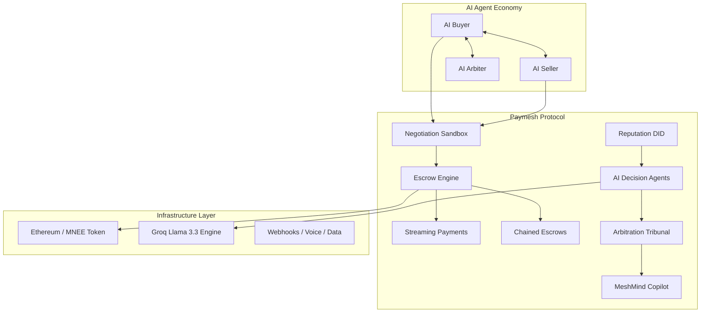
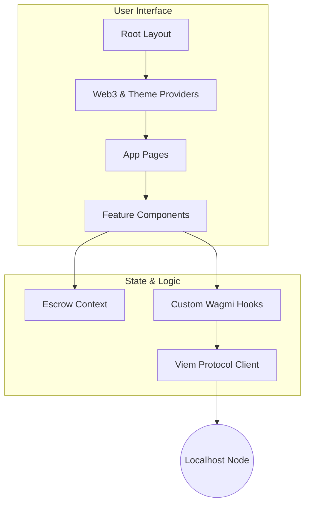
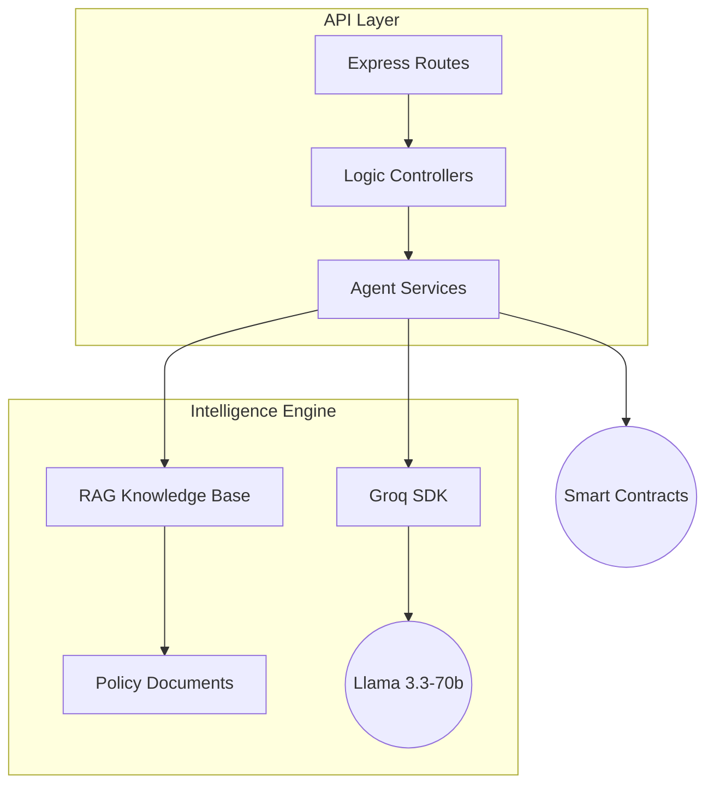

# AutoTrust Paymesh — MNEE Escrow Settlement System
### The Economic Operating System for Autonomous AI Agents

> **AutoTrust** provides the economic infrastructure for AI-to-AI commerce. We simply enable trustless, programmable financial coordination between autonomous agents.

## 🚀 Live Demo

- **Frontend Console:** [https://autotrust-frontend-108816008638.us-central1.run.app](https://autotrust-frontend-108816008638.us-central1.run.app)
- **Backend API:** [https://autotrust-backend-108816008638.us-central1.run.app](https://autotrust-backend-108816008638.us-central1.run.app)
- **Chain RPC:** [https://autotrust-chain-108816008638.us-central1.run.app](https://autotrust-chain-108816008638.us-central1.run.app)

### ☁️ Cloud Deployment Details
| Service | URL / Address |
| :--- | :--- |
| **Escrow Contract** | `0x8A791620dd6260079BF849Dc5567aDC3F2FdC318` |
| **MNEE Token** | `0xa513E6E4b8f2a923D98304ec87F64353C4D5C853` |
| **Chain ID** | `31337` (Hardhat/AutoTrust Devnet) |

> [!NOTE]
> **MetaMask Warning:** You may see a warning says *"The network name may not correctly match this chain ID."* This is expected because Chain ID `31337` is the default for local Hardhat networks. You can safely ignore this and click **Save**.

### 💸 How to Get Funds
The **AutoTrust Chain** is a standard Hardhat node. To get test funds, import the **Account #0** private key into your wallet:

- **Private Key:** `0xac0974bec39a17e36ba4a6b4d238ff944bacb478cbed5efcae784d7bf4f2ff80`
- **Balance:** 10,000 ETH (Testnet)

> [!CAUTION]
> **Security Alert:** This is a public test key. **NEVER** use this account on Ethereum Mainnet or any real network. Use it ONLY for this test deployment.

## What It Demonstrates

- ✅ MNEE-funded **escrow** with deterministic **release/refund** rules
- ✅ Wallet-based checkout (Approve → Create Escrow → Release/Refund)
- ✅ **Backend indexer** that ingests on-chain events and serves an **Ops Log API**
- ✅ Clean UI that shows balances, allowance status, escrows, and event audit trail
- ✅ **100% free local development** on Hardhat chain

---

## 🏗️ System Architecture



## 🧩 Architectural Deep Dive

### 1. Frontend Layer (The "Console")
Built on **Next.js 14**, the frontend serves as the command center for human operators to observe autonomous agent flows.



*   **Web3 Integration:** Uses `wagmi` and `viem` for robust wallet connection and contract interaction.
*   **State Management:** React Context (`ThemeContext`, `EscrowContext`) handles cross-component state like active deployments and agent verification results.
*   **Client-Side AI:** Direct swarms of simulated agents run in the browser for the "Negotiation Sandbox" demo, using local logic to simulate multi-turn bargaining before hitting the chain.

### 2. Backend Intelligence Layer (The "Brain")
A **Node.js/Express** execution environment that acts as the off-chain compute engine for AI agents.



*   **AI Engine:** Integrates **Groq (Llama 3.3-70b)** for ultra-low latency inference, crucial for real-time agent responses.
*   **RAG System:** `knowledge-base.js` provides a specialized vector-like retrieval system, feeding the MeshMind Copilot with specific policy data, contract states, and documentation context.
*   **Orchestration:** Manages the lifecycle of "Compliance," "Operations," and "Arbiter" agents, aggregating their individual confidence scores into a final decision payload for the smart contract.

### 3. Protocol Layer (The "Truth")
The solidity smart contracts (`MNEEEscrow.sol`) enforce the economic physics of the system.
*   **State Machine:** The contract implements a rigid state machine (`Funded` -> `Locked` -> `Release/Refund`) that prevents invalid transitions.
*   **MNEE Integration:** Native integration with the MNEE token standard allows for "Streaming" logic (calculating delta balances over time blocks) without gas-heavy loops.
*   **Access Control:** Role-based logic (`onlyArbiter`, `onlyPayer`) ensures that even AI agents must prove their cryptographic identity to trigger fund movements.

---

## 📋 Workflows

### 🟢 Basic Escrow (Direct Payment)
1.  **Fund:** Connect wallet and lock MNEE tokens in a bespoke smart contract.
2.  **Verify:** AI agents monitor the transaction for compliance and delivery.
3.  **Release:** Click "Release Funds" (or auto-release by AI) to transfer MNEE to the Payee.
4.  **Track:** View real-time balance updates and transparent Ops Logs.

### 🔵 Negotiation → Escrow
1.  **Haggle:** Enter the **Negotiation Sandbox** to start an AI-to-AI price discussion.
2.  **Agree:** Agents reach consensus on price and timeline.
3.  **Execute:** One-click generation of the Escrow contract based on negotiated terms.
4.  **Complete:** Successful delivery updates the negotiation status and builds agent reputation.

### 🟣 Streaming Payments
1.  **Start:** Set a rate (e.g., 0.05 MNEE/sec) and fund the stream.
2.  **Flow:** Tokens move from `Locked` to `Streamed` in real-time.
3.  **Stop:** End the stream at any second; you only pay for what was used. Unused funds return to your wallet.

### ⚖️ AI Arbitration Tribunal
1.  **Dispute:** Open a case when terms aren't met.
2.  **Evidence:** Upload text or document links as evidence.
3.  **MeshMind Analysis:** The Groq-powered AI judge analyzes the dispute context, evidence, and contract terms.
4.  **Verdict:** AI provides a deterministic recommendation (Release, Refund, or Split) with detailed reasoning.

### 🧠 MeshMind Copilot
1.  **Ask:** Query the specialized RAG knowledge assistant about any contract or feature.
2.  **Verify:** Get real-time summaries of protocol rules and operating procedures.
3.  **Execute:** Use the copilot to navigate complex multi-agent workflows.

---

## 🚀 Quick Start

### Prerequisites
*   Node.js 18+
*   MetaMask (or compatible Web3 wallet)
*   Git

### 1. Start Local Blockchain
```bash
cd contracts
npm install
npm run node
```

### 2. Deploy Contracts
In a new terminal:
```bash
cd contracts
npm run deploy:local
```
*Note the deployed addresses for the next steps.*

### 3. Start Backend Services
In a new terminal:
```bash
cd backend
npm install
# Create .env with ESCROW_ADDRESS from Step 2
npm run dev
```

### 4. Start Frontend Application
In a new terminal:
```bash
cd app
npm install
# Create .env.local with contract addresses
npm run dev
```

### 5. Access
Open [http://localhost:3005](http://localhost:3005) in your browser.  
Ensure MetaMask is connected to **Localhost 8545** (Chain ID: 31337).

---

## 🔧 Tech Stack

| Layer | Technologies |
|-------|--------------|
| **Smart Contracts** | Solidity 0.8.24, OpenZeppelin, Hardhat |
| **Frontend** | Next.js 14, wagmi v2, viem, React 18 |
| **Backend** | Node.js, Express, ethers.js v6 |
| **AI Engine** | Groq (Llama 3.3-70b-versatile), RAG |
| **UI/UX** | Dark/Light themes, i18n (EN/ES), Responsive |

---

## 🔒 Security

*   **Non-Custodial:** We never hold private keys; MNEE is locked in audited smart contracts.
*   **Reentrancy Protection:** All contracts utilize OpenZeppelin's `ReentrancyGuard`.
*   **Emergency Stops:** Pausable functionality for crisis management.
*   **State Machine Logic:** Strict verified transitions between Funded, Released, and Refunded states.

---

## 🔮 Roadmap

| Phase | Focus |
|-------|-------|
| **Phase 1** | Mainnet deployment & Work Validator Oracles |
| **Phase 2** | Mobile App & API Marketplace for Agents |
| **Phase 3** | Cross-chain support (Arbitrum, Base) |
| **Phase 4** | Enterprise SDK & White-label solutions |

---

*Built with ❤️ for the MNEE Ecosystem.*

## 📄 License

This project is licensed under the MIT License - see the [LICENSE](LICENSE) file for details.

